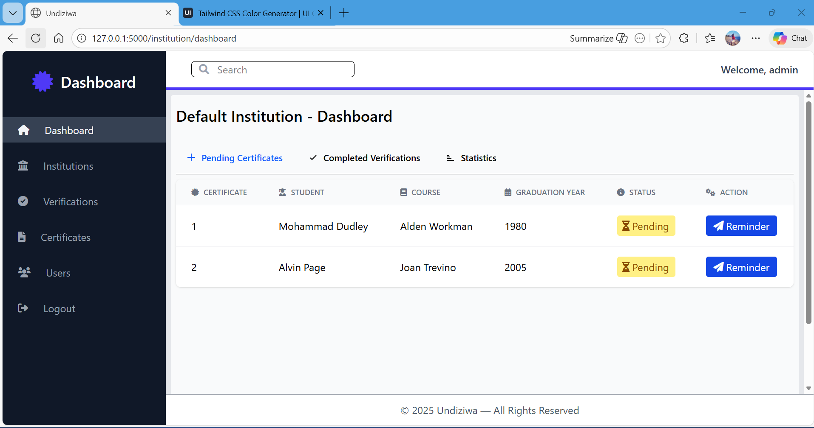
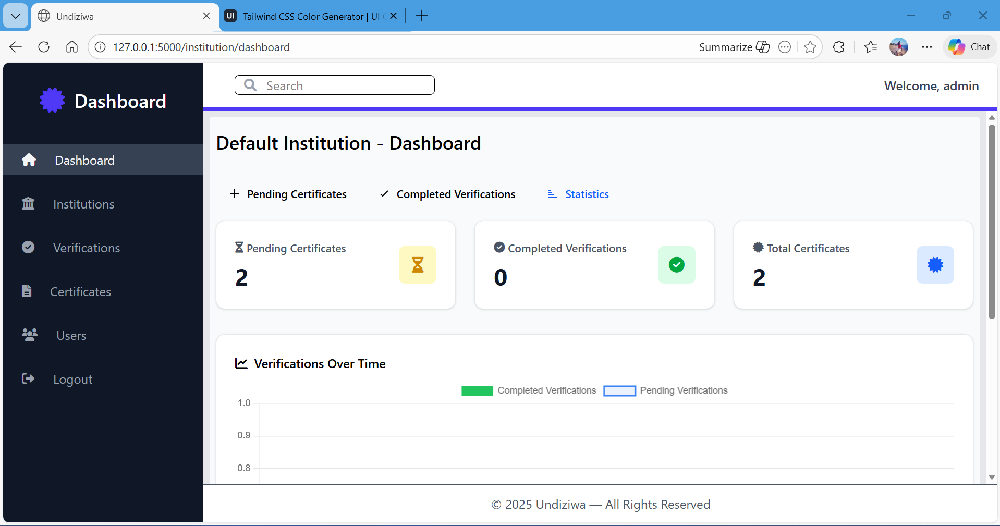

# Undiziwa – Fast Certificate Verification System

[](https://www.python.org/)
[](https://flask.palletsprojects.com/)
[](https://tailwindcss.com/)
[](https://www.chartjs.org/)
[](LICENSE)

**Undiziwa** is a secure, fast certificate verification system. Institutions verify certificates, users submit them for validation, and recruiters can fast-track verification for hiring or credential checks.

---

## 🔹 Features

* **Institution Verification:** Certificates are verified before being marked valid
* **User Submission:** Upload certificates for verification
* **Fast-track Verification:** Recruiters verify multiple certificates quickly
* **Secure Storage & Audit:** Verification activities logged for transparency
* **QR Code Support:** Verified certificates include unique QR codes
* **Analytics Dashboard:** Track verifications using interactive Chart.js charts

---

## 🛠 Tech Stack

* **Backend:** Flask
* **Frontend:** Tailwind CSS
* **Charts & Visualization:** Chart.js
* **Database:**  MySQL / SQLite
* **Authentication:** Flask-Login


---

## Demo

Try the live demo: [🔗 https://undiziwa-certificate-verification-system.onrender.com/login](#)  
*Insert screenshots or GIFs to showcase your system.*

Example dashboard screenshot:  



---

## Quick Start

```bash
# Clone the repository
git clone https://github.com/yourusername/undiziwa.git
cd undiziwa

# Install dependencies
pip install -r requirements.txt

# Create .env file
FLASK_APP=app.py
FLASK_ENV=development
DATABASE_URL=your_database_url

# Run the application
flask run
